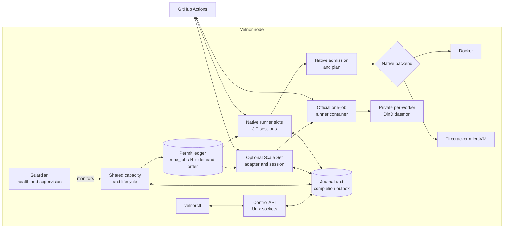
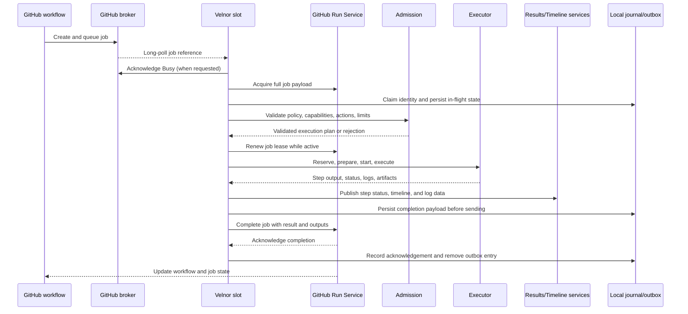

# Velnor architecture

Velnor is a node-local control plane for GitHub Actions with two local
execution lanes. GitHub remains the workflow scheduler and source of truth.
The native lane uses Velnor runner slots and an explicitly selected Docker or
Firecracker microVM backend. The optional Scale Set lane uses an official
one-job Actions runner container paired with a private per-worker DinD daemon.
Both local lanes share one host-wide permit ledger.

Velnor does not maintain a competing workflow scheduler. Its shared local
queue orders eligible demand that Velnor has observed; it cannot create GitHub
work or guarantee order from GitHub submission through job completion. The
native lane does not silently switch backend when its configured backend is
unavailable.

## Responsibility boundaries

| Owner | Responsibilities |
| --- | --- |
| GitHub Actions | Workflow and job creation, runner matching, job payload authority, remote run state, hosted service APIs, and the user-facing workflow result. |
| Velnor control plane | Node identity, shared host capacity, fresh eligible demand ordering across local lanes, admission decisions, lifecycle state, bounded events, and recovery intent. |
| Native Velnor runner | JIT registration, broker sessions, job acquisition, lease renewal, native job execution, progress publishing, completion reporting, and cleanup. |
| Scale Set adapter | Scale Set registration and sessions, durable offer handling, shared-ledger acquisition, and official-worker lifecycle and cleanup. |
| Native execution backend | Isolation and process/container lifecycle for a validated native job: Docker or Firecracker microVM. |
| Scale Set worker | One official Actions runner container paired with its own private DinD daemon. |
| Operator | GitHub policy, labels, credentials, native backend choice, optional Scale Set configuration, service lifecycle, and health/failure signals. |

Velnor knows what it has registered, what it has accepted locally, what its
capacity can run, and what it has sent or durably staged for GitHub. GitHub
knows the authoritative workflow graph, job state, runner assignment, and
remote result. Neither side should be inferred from the other side's local
projection during an outage.

## System shape

In the native lane, the daemon manages desired slot capacity and lifecycle.
Each ready slot is an independent runner process with its own GitHub session.
An acquired job runs in a transient job boundary beneath that slot. Controller
restart does not by itself terminate surviving slot or active-job processes;
generation and heartbeat checks prevent stale children from proving current
readiness. The Scale Set adapter uses the same host-wide permit ledger and
persists deferred offers so they can resume on later or idle polls.

Native readiness is a proof, not merely a live process: local state must be
writable, the selected backend must pass preflight, GitHub registration must
be valid, and slot heartbeats must be fresh. The Scale Set lane has separate
registration, session, and worker prerequisites. Failure of a required
condition makes that lane unavailable or degraded rather than schedulable by
implication.

## Native Velnor job flow

This flow describes the native lane. Its important ordering is:

1. GitHub creates the job and decides which labels and runner scope match.
2. A Velnor slot learns of work through an authenticated broker session. REST
   queue listings are diagnostic; they do not assign work to Velnor.
3. The broker message identifies the run-service request. Velnor acquires the
   complete job payload through the Run Service.
4. Velnor claims the job locally, then resolves the complete action closure,
   policy, capability requirements, references, inputs, and resource limits.
5. Only an admitted job receives leases, capacity, checkout, downloads,
   credentials, cache mutation, services, or executor resources.
6. The plan selects exactly one configured backend. Its lifecycle is
   `preflight → reserve → prepare → start → execute or cancel → collect → teardown`.
7. Velnor publishes progress while steps run, renews the GitHub lease, and
   handles broker cancellation messages.
8. Publishers drain before terminal completion. Velnor stages the completion
   payload locally, sends it to GitHub, records remote acknowledgement, then
   cleans local in-flight state.

## Scale Set job flow

The optional Scale Set lane uses GitHub's Scale Set session and the official
Actions runner protocol. Velnor persists offered demand before acknowledging
the Scale Set message. It grants fresh eligible demand through the shared
permit ledger, then provisions one official runner container with a private
DinD daemon for the acquired job. If the ledger has no free permit, the offer
stays durably queued and a later message or idle poll can retry it; this is not
the native broker-redelivery path. The permit remains held through terminal
work and owned cleanup.

Velnor orders permit admission by the oldest fresh eligible demand it has
observed across both local lanes and scopes. GitHub still controls when offers
arrive, which eligible runner receives a job, and actual job start/completion
order. The shared local order is not GitHub submission-order FIFO.

## Initiators and transport types

| Interaction | Initiator | Transport and behavior |
| --- | --- | --- |
| Workflow/job creation | GitHub | Internal GitHub scheduling. Velnor does not initiate it. |
| Native runner registration | Native Velnor runner | Authenticated HTTPS request for a JIT runner configuration; successful registration is an explicit response. |
| Scale Set registration | Scale Set adapter | Reconciles the configured runner group and Scale Set, then opens and maintains a Scale Set session. |
| Native work delivery | Native Velnor runner | Authenticated long-poll to the broker. Empty responses mean idle; authentication and other non-success responses are failures. |
| Scale Set messages | Scale Set adapter | Authenticated long-poll to the Scale Set session; offers and deferred demand are persisted before successful acknowledgement. |
| Busy acknowledgement | Native Velnor runner | Optional authenticated HTTPS request to the broker after receiving a job reference. |
| Native job acquisition | Native Velnor runner | Authenticated request/response to the Run Service. Transient failures retry; permanent failures end the session or job attempt. |
| Scale Set job acquisition | Scale Set adapter | Acquires eligible offered requests through the Scale Set protocol after shared-ledger permits are committed. |
| Native lease renewal | Native Velnor runner | Repeated authenticated request/response while a job is active. |
| Native cancellation delivery | Native Velnor runner | Active-session broker polling. The runner matches the cancellation to its job. |
| Native step status and logs | Native Velnor runner | Authenticated uploads to Results Service and timeline/feed services; progress publishing is best effort and bounded. |
| Native completion | Native Velnor runner | Authenticated Run Service request/response carrying terminal result, outputs, and metadata. |
| Scale Set job protocol | Official runner container | The unmodified official runner handles its job session, lease renewal, cancellation, status/log publishing, and completion with GitHub. |
| Workflow generation | `velnor-workflow` | Static repository scan, owned workflow/config rendering, affected-unit planning, policy, and release checks. It does not schedule GitHub work. |
| Workflow monitoring | `velnor-tools` | Read-only correlation of GitHub run state with Velnor control-plane evidence. GitHub owns the terminal result. |
| Operator inspection | Operator | Local Unix-socket control API, local health files, metrics files, and bounded local logs, normally through `velnorctl`. |

GitHub initiates scheduling and sends work requests. Velnor initiates its
control-plane operations: native broker polling, Scale Set registration and
polling, and Scale Set acquisition. After a Scale Set worker starts, the
official runner initiates its own job-protocol requests to GitHub. There is no
inbound GitHub callback into the Velnor daemon in the normal runner flow.

## Admission, execution, and isolation

Native admission resolves local, remote, and composite action requirements
before side effects against a closed allowlist of action identities. An action
that is not on the allowlist, an unpinned or invalid reference, an input outside
an action's declared rules, a capability mismatch, a trust-policy violation,
or a resource-bound failure is rejected closed. See
[what Velnor does not support](/guides/execution#what-velnor-does-not-support).

Scale Set offer classification is separate. It uses the event name and
owner/repository fields from the offer: unparseable events or missing
owner/repository values, plus `pull_request` and `workflow_run` events, remain
`unknown`; other parseable events with both nonempty owner and repository
fields are `trusted`. Offers do not include the head-repository data needed to
classify those fork-sensitive events.

In the native lane, Docker uses the host Docker socket within the configured
host and cgroup boundary. Firecracker uses KVM, verified artifacts, a jailer,
isolated namespaces and networking, and a guest agent. Firecracker rejects
host Docker socket access. These native backends are not interchangeable and
there is no automatic fallback between them. In the Scale Set lane, the
official runner reaches only its paired private DinD daemon; it does not use
the host Docker socket.

For native jobs, the plan carries workspace, environment, services, outputs,
masks, cache and artifact operations, and step execution data. Native job
credentials come from the acquired GitHub payload; the operator registration
credential is not substituted for them. For Scale Set jobs, Velnor supplies
the JIT runner configuration and the official runner receives job credentials
through its GitHub session. Credentials are excluded from reusable microVM
snapshots and sanitized from operational evidence.

## Interruptions and recovery

Transient broker, acquisition, lease, and upload failures use bounded retries
or backoff according to operation. Authentication failures require credential
recovery; missing runner registration requires session recreation. A node that
cannot prove GitHub connectivity or routing readiness must not claim new work.

During native-lane drain, idle slots deregister and stop at a poll boundary.
Native active jobs may be terminated if bounded service-stop escalation
reaches its deadline. The Scale Set adapter stops polling. Healthy runner and
DinD containers, durable demand, and held permits remain available for
adoption after the daemon restarts; the native service drain deadline does not
terminate healthy Scale Set work.

Native cancellation is checked separately for active jobs. One cancellation
token per job carries two levels, `Requested` and `Forced`; each thing that can
be terminated registers the level at which it may die, and is walked down a
`SIGINT → SIGTERM → SIGKILL` ladder. Cancellation signals; removal is
teardown's job. Malformed cancellation input is treated conservatively as
cancellation. The Scale Set lane delegates job cancellation to the official
runner. See [Cancellation](/guides/execution#cancellation).

Native completion has a stronger durability contract than ordinary progress.
Velnor records the terminal conclusion, writes the exact job/generation
payload to a local outbox file, journals the intent and its digest, takes one
durable send claim, and only then transports it. After a crash, recovery
replays the same payload under the same claim rather than inventing a second
completion. The Scale Set official runner reports its own job completion to
GitHub; Velnor tracks the worker lifecycle and cleanup.

The outbox is bounded rather than infinite. An entry ends in one of three ways:
GitHub acknowledges it; the run service reports the job already terminal; or
its budget — a permanent refusal, eight attempts, or six hours — is spent, in
which case the entry is abandoned, GitHub is never told, and the reason is
preserved in the journal. Orphaned, malformed, symlinked, oversized, or
ambiguous outbox entries fail closed and are quarantined for diagnosis.

Progress logs and telemetry are bounded operational evidence, not an archival
record. Local projections may be incomplete after service recreation; durable
events and completion intent are the stronger recovery evidence.

## Native cancellation

The Velnor-native runner follows the upstream GitHub Runner V2 shapes for
broker sessions, job acquisition, lease renewal, and completion. Cancellation
is modelled on upstream's split — the current step's host process group and
Docker-action sidecars die on the cancel token, while the job and service
containers are stopped later so `always()` and `cancelled()` post steps still
have a container to run in.

The live native path registers host process groups, job and service
containers, and Docker-action sidecars with the cancellation token. For
Firecracker, the active job token registers the jailer process group as the
termination fallback. A guest `Cancel` hook is also registered when a vsock
cancel handle is available; without that handle, cancellation falls back to
the jailer process group. Container and process-group targets use the signal
ladder; the guest hook attempts graceful cancellation. Teardown owns resource
removal.

## Operator mental model

Use GitHub to answer: was the job created, what runner labels and scope does it
require, and what state did GitHub accept? Use Velnor to answer: which lane is
configured, is its runner or worker ready, was the job admitted, which native
backend or official worker handled it, what capacity decision occurred, and
whether completion is staged or acknowledged.

For commands and current visibility limits, see the [interface reference](/reference/interface).
For installation and service lifecycle, see the [operator guide](/guides/operator).
