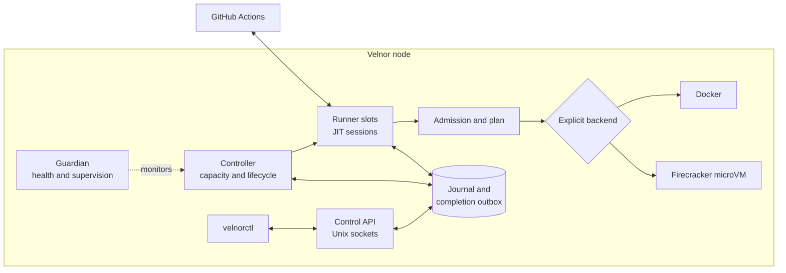
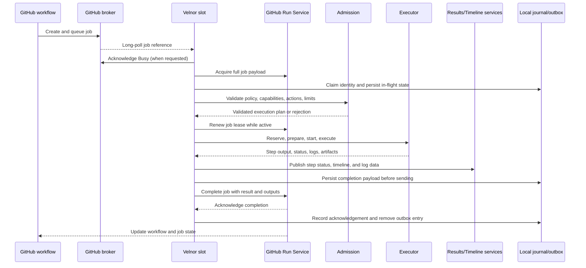

# Velnor architecture

Velnor is a node-local execution system for GitHub Actions. GitHub remains the
workflow scheduler and source of truth. Velnor provides ephemeral runner
capacity, validates work, executes it in an explicitly selected backend, and
reports the outcome.

Velnor does not maintain a competing workflow scheduler. A local queue cannot
create GitHub work, and a Velnor node does not silently switch to another
executor when its configured backend is unavailable.

## Responsibility boundaries

| Owner | Responsibilities |
| --- | --- |
| GitHub Actions | Workflow and job creation, runner matching, job payload authority, remote run state, hosted service APIs, and the user-facing workflow result. |
| Velnor control plane | Node identity, capacity, admission decisions, local lifecycle state, bounded operational events, and recovery intent. |
| Velnor runner | JIT registration, broker sessions, job acquisition, lease renewal, execution coordination, progress publishing, completion reporting, and cleanup. |
| Execution backend | Isolation and process/container lifecycle for one validated job: Docker or Firecracker microVM. |
| Operator | GitHub policy, labels, credentials, backend choice, service lifecycle, and interpretation of health and failure signals. |

Velnor knows what it has registered, what it has accepted locally, what its
capacity can run, and what it has sent or durably staged for GitHub. GitHub
knows the authoritative workflow graph, job state, runner assignment, and
remote result. Neither side should be inferred from the other side's local
projection during an outage.

## System shape

The daemon controller manages desired slot capacity and lifecycle. Each ready
slot is an independent runner process with its own GitHub session. An acquired
job runs in a transient job boundary beneath that slot. Controller restart does
not by itself terminate surviving slot or active-job processes; generation and
heartbeat checks prevent stale children from proving current readiness.

Readiness is a proof, not merely a live process: local state must be writable,
the selected backend must pass preflight, GitHub registration must be valid,
and slot heartbeats must be fresh. Failure of any required condition makes the
node unavailable or degraded rather than schedulable by implication.

## End-to-end job flow

The important ordering is:

1. GitHub creates the job and decides which labels and runner scope match.
2. A Velnor slot learns of work through an authenticated broker session. REST
   queue listings are diagnostic; they do not assign work to Velnor.
3. The broker message identifies the run-service request. Velnor acquires the
   complete job payload through the Run Service.
4. Velnor claims the job locally, then resolves the complete action closure,
   policy, capability requirements, references, inputs, and resource limits.
5. Only an admitted job receives leases, capacity, checkout, downloads,
   credentials, cache mutation, services, or executor resources.
6. The plan selects exactly one configured backend. Its lifecycle is
   `preflight → reserve → prepare → start → execute or cancel → collect → teardown`.
7. Velnor publishes progress while steps run, renews the GitHub lease, and
   handles broker cancellation messages.
8. Publishers drain before terminal completion. Velnor stages the completion
   payload locally, sends it to GitHub, records remote acknowledgement, then
   cleans local in-flight state.

## Initiators and transport types

| Interaction | Initiator | Transport and behavior |
| --- | --- | --- |
| Workflow/job creation | GitHub | Internal GitHub scheduling. Velnor does not initiate it. |
| Runner registration | Velnor | Authenticated HTTPS request for a JIT runner configuration; successful registration is an explicit response. |
| Work delivery | Velnor | Authenticated long-poll to the broker. Empty responses mean idle; authentication and other non-success responses are failures. |
| Busy acknowledgement | Velnor | Optional authenticated HTTPS request to the broker after receiving a job reference. |
| Job acquisition | Velnor | Authenticated request/response to the Run Service. Transient failures retry; permanent failures end the session or job attempt. |
| Lease renewal | Velnor | Repeated authenticated request/response while a job is active. |
| Cancellation delivery | Velnor | Active-session broker polling. The runner matches the cancellation to its job. |
| Step status and logs | Velnor | Authenticated uploads to Results Service and timeline/feed services; progress publishing is best effort and bounded. |
| Completion | Velnor | Authenticated Run Service request/response carrying terminal result, outputs, and metadata. |
| Operator inspection | Operator | Local Unix-socket control API, local health files, metrics files, and bounded local logs, normally through `velnorctl`. |

GitHub initiates scheduling and sends work requests. Velnor initiates every
runner-side network operation after registration: it polls, acquires, renews,
uploads, and completes. There is no inbound GitHub callback into the Velnor
daemon in the normal runner flow.

## Admission, execution, and isolation

Admission resolves local, remote, and composite action requirements before
side effects. Unknown or unsupported action forms, invalid references,
capability mismatches, trust-policy violations, and resource-bound failures
are rejected closed.

Docker uses the host Docker socket within the configured host and cgroup
boundary. Firecracker uses KVM, verified artifacts, a jailer, isolated
namespaces and networking, and a guest agent. Firecracker rejects host Docker
socket access. The two paths are not interchangeable and there is no automatic
fallback between them.

The job plan carries workspace, environment, services, outputs, masks, cache
and artifact operations, and step execution data. Job credentials come from
the acquired GitHub job payload; the operator registration credential is not
substituted for job credentials. Credentials are excluded from reusable
microVM snapshots and sanitized from operational evidence.

## Interruptions and recovery

Transient broker, acquisition, lease, and upload failures use bounded retries
or backoff according to operation. Authentication failures require credential
recovery; missing runner registration requires session recreation. A node that
cannot prove GitHub connectivity or routing readiness must not claim new work.

During drain, idle slots deregister and stop at a poll boundary. Active jobs
continue long enough to finish and report when possible. Stop escalation is
bounded by service policy; active work is eventually terminated if the drain
deadline expires.

Cancellation is checked separately for active jobs. Velnor cancels execution,
collects what it can, publishes the terminal state, and completes the GitHub
job. Malformed cancellation input is treated conservatively as cancellation.

Completion has a stronger durability contract than ordinary progress. Velnor
writes the exact job/generation completion payload to a local outbox before
transport. It removes that entry only after GitHub's terminal acknowledgement.
After a crash, recovery can replay the same payload rather than inventing a
second completion. Orphaned, malformed, symlinked, oversized, or ambiguous
outbox entries fail closed and are preserved or quarantined for diagnosis.

Progress logs and telemetry are bounded operational evidence, not an archival
record. Local projections may be incomplete after service recreation; durable
events and completion intent are the stronger recovery evidence.

## Cancellation difference from the upstream runner

Velnor follows the upstream GitHub Runner V2 shapes for broker sessions, job
acquisition, lease renewal, and completion. Its active-job cancellation path is
not fully equivalent to upstream behavior.

The upstream runner dispatches cancellation to the worker, allows graceful
handling, and escalates after a cancellation timeout. Velnor's Docker path
currently performs host-side container termination from its active cancellation
path. Firecracker cancellation is narrower and is not end-to-end equivalent to
the upstream worker-dispatch model. Operators must therefore treat a
cancellation as a Velnor termination/recovery event, not assume identical
step-level cancellation semantics.

## Operator mental model

Use GitHub to answer: was the job created, what runner labels and scope does it
require, and what state did GitHub accept? Use Velnor to answer: is a slot
registered and ready, was the job admitted, which backend ran it, what local
failure or capacity decision occurred, and whether completion is staged or
acknowledged.

For commands and current visibility limits, see the [interface reference](/docs/reference/interface).
For installation and service lifecycle, see the [operator guide](/docs/guides/operator).
