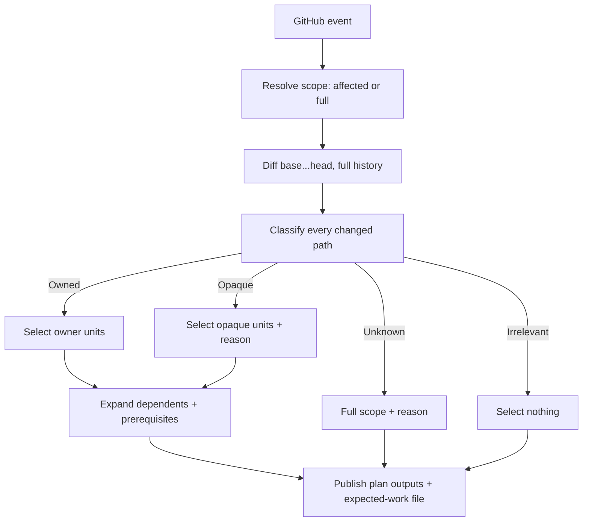

# Change-aware planning

This is an Explanation of how Velnor chooses CI work from a change set: the
planner builds the smallest sound CI-selection plan (the affected-unit
selection) from the full event diff and the declared task dependencies, and
proven-irrelevant changes schedule no unrelated workloads. A CI-selection plan
is not the validated job [execution plan](/concepts/architecture): the former
decides which units run, the latter is the backend-neutral job a runner
executes after admission. See the [glossary](/concepts/glossary) for the
pinned term boundaries.

Every behavior claim below carries a status label: `CURRENT` means implemented
on this branch with cited source and tests; `FUTURE` means planned, ungated,
or otherwise not a current capability claim. Status follows the
[contributing evidence rules](/guides/contributing).

## The selection pipeline

`CURRENT`: the plan job checks out with full history, diffs the whole event
range, classifies every changed path, expands the result across dependency
edges, and publishes the plan plus the expected-work file the aggregate later
scores against.

The diff is always the three-dot range `base...head`
(`crates/velnor-workflow/src/runtime.rs:2976-2992`), and the plan job checks
out with `fetch-depth: 0`, so no truncation can hide a change
(`crates/velnor-workflow/src/primitives/ir.rs:6341`). The sibling schema-2
runtime mirrors the same pipeline
(`crates/velnor-workflow/src/s2/runtime.rs:2704-2808`).

## Owned, Opaque, Unknown, Irrelevant

`CURRENT`: each changed path gets exactly one verdict from `classify_path`
(`crates/velnor-workflow/src/reuse.rs:650-707`):

- `OWNED` — some unit's watch globs or extracted command read-globs match the
  path. The owners are selected.
- `OPAQUE` — no unit owns the path but some (not every) unit is opaque (its
  commands resist proof). Only the opaque units are selected, plus the
  ordinary dependency closure, with an explicit reason naming the consulted
  sources, every opaque unit, and the missing narrowing contract.
- `IRRELEVANT` — no unit watches or reads the path and no unit is opaque.
  The path selects nothing.
- `UNKNOWN` — the path itself cannot be matched safely, or every unit is
  opaque so narrowing is impossible. The plan falls back to the full set with
  an explicit reason naming the consulted sources: declared reads, watch
  globs, and command read-globs. An unmatched path also names the missing
  contract; an unmatchable path (empty, quoted) carries no contract hint
  because no contract can cover a path the matcher cannot spell.

Owned wins over opaque (`crates/velnor-workflow/src/reuse.rs:680-682`): a
proven owner selects its units even when another unit's commands resist proof.
Opacity is per unit, never per path. An empty changed path and a quoted diff
path are `UNKNOWN` by construction
(`crates/velnor-workflow/src/reuse.rs:651-666`).

A rename contributes both sides — target as renamed, source as deleted — so
the old and new owners both match; a delete keeps its path so its owner still
matches (`crates/velnor-workflow/src/reuse.rs:137-152`). There is no blanket
prefix fallback: the force-full prefix list is empty
(`crates/velnor-workflow/src/reuse.rs:60`), and `.github/` paths go through
the contract table below instead.

## Dependency semantics

`CURRENT`: direct path hits expand across `depends_on` edges in one direction
(`crates/velnor-workflow/src/reuse.rs:1095-1099`):

- Dependents of a changed unit join the affected set — changed inputs flow
  downstream, so downstream verdicts need re-proving.
- Prerequisites of a selected unit join the required set afterwards, without
  pulling their own dependents: their outputs must exist before the run, but
  their other consumers are unaffected.

Edges are followed across unit kinds: a cross-language dependency invalidates
exactly like a same-language one
(`crates/velnor-workflow/src/reuse.rs:257-259`). Every selected unit carries an
explanation naming its paths or the edge that pulled it in
(`crates/velnor-workflow/src/reuse.rs:396-446`).

Three narrower rules run around the classifier, in order. `CURRENT`:

1. A version-bump-only change selects the configured allowlist plus the
   matching workspace checks, before irrelevant-skip is considered
   (`crates/velnor-workflow/src/runtime.rs:2718-2740`).
2. Workspace checks join only when they share a Cargo lockfile root with a
   directly selected Rust unit, so independent Cargo projects stay
   affected-only (`crates/velnor-workflow/src/runtime.rs:2826-2848`).
3. Lane admission narrows the selection to units the admitted lanes can run;
   units of an unknown kind are kept, never silently dropped
   (`crates/velnor-workflow/src/runtime.rs:1872-1916`).

## Event behavior

`CURRENT`: the event decides the scope before any diff runs
(`crates/velnor-workflow/src/runtime.rs:1817-1848`).

| Event | Scope | Override |
| --- | --- | --- |
| `pull_request` | `affected` (whole-PR diff) | `affected`/`full` override accepted |
| `push`, `schedule`, `merge_group` | `full` (trusted events) | narrowing rejected: `trusted events require full CI scope` |
| `workflow_dispatch` | `full` | `affected` accepted explicitly |
| (empty, local) | `full` default | override accepted |
| anything else | rejected | `unsupported CI event` |

Push, schedule, and merge-queue validation are trusted events: the merge ref
has no pull-request base to diff against, so merge-queue validation always
runs full scope. Release and maintenance lanes sit outside affected planning:
changes to `release.yml`, `maintenance.yml`, and the release-signer and
runtime-products workflows select nothing in affected scope (release-scoped
verdict, next section), and the event table above admits no release event.

## The `.github/` contract table

`CURRENT`: CI-contract paths under `.github/` classify through
`github_verdict`, not a blanket rule
(`crates/velnor-workflow/src/reuse.rs:1028-1078`):

- Four global classes stay full with a reason: the scheduling aggregates
  (`workflows/ci-pr.yml`, `workflows/ci-main.yml`, `workflows/nightly.yml`,
  `workflows/preview.yml`), the policy gate plus its config
  (`workflows/ci-policy.yml`, `actionlint.yaml`), the plan input
  (`ci/project.toml`), and the toolchain action every job uses
  (`actions/setup-velnor-workflow/`).
- Kind reusables (`workflows/ci-unit-<kind>.yml`) narrow to units of the
  named kind; a reusable naming an unknown kind (outside `KNOWN_KINDS`)
  is unknown.
- Release and maintenance lanes
  (`workflows/ci-runtime-products.yml`,
  `workflows/ci-release-package-signer.yml`, `workflows/release.yml`,
  `workflows/maintenance.yml`) are release-scoped: they select nothing
  outside their own scope.
- Every other `.github/` path — the reporting action, contract docs,
  unlisted files — stays unknown and fails closed to full with its reason.

## Declared read contracts

`CURRENT`: relationships the scan cannot discover (opaque task runners,
helper scripts, dynamic includes) are declared in a typed generation-time
`reads` table mapping unit ids to contract entries
(`crates/velnor-workflow/src/primitives/mod.rs:599-836`):

- Every entry spells `paths` (an array of valid watch globs, possibly
  empty), `reason` (a non-empty string auditing the claim), and `type`
  (one of `"paths"`, `"script"`, or `"unresolved"`; absent means
  `"paths"`). A `"script"` contract adds `script` (the repo-relative
  opaque script path, treated as data — never executed or
  existence-checked); an `"unresolved"` contract adds `limitation` (a
  non-empty record of the unprovable mechanism). An unknown type, a
  misplaced key, an escaping script, an invalid glob, or an empty reason
  fails generation closed.
- Named units must exist in the scan; a declaration for a unit the scan did
  not produce is a usage error listing the available units.
- The `watch-graph` primitive unions the paths (plus the bound script)
  into the unit's watch set, so the runtime contract is unchanged: no
  schema bump, and selection sees owned paths through the ordinary watch
  matcher (`crates/velnor-workflow/src/primitives/watch.rs:124-131`).

Declared coverage composes with opacity: a declared path still narrows to its
owners even when other units stay opaque
(`crates/velnor-workflow/src/reuse.rs:764-767`), so a changed script under a
`script` contract selects exactly its unit instead of every opaque unit. No
contract type narrows beyond the paths it covers: uncovered paths keep the
conservative fallback, and the fallback reason names the missing contract,
so unknown impact reports the exact `reads` keys that would narrow it
(`crates/velnor-workflow/src/reuse.rs:709-725`).

## Plan outputs and how to inspect a plan

`CURRENT`: `velnor-workflow plan --config .github/ci/project.toml` reads its
inputs from the environment — `EVENT_NAME`, `CI_SCOPE_OVERRIDE`, `BASE_SHA`,
`HEAD_SHA`, `VELNOR_LANES`, `VELNOR_SELECTION_FILE`,
`VELNOR_EXPECTED_WORK_FILE`, `GITHUB_OUTPUT`
(`crates/velnor-workflow/src/runtime.rs:1674-1691`) — and publishes the
selection to stdout, `$GITHUB_OUTPUT`, the selection file, and the
expected-work file. The full output-field reference is in the
[interface reference](/reference/interface#workflow-generation-and-monitoring);
the reason-bearing fields are `fallback_reason` (present on full fallback
and on opaque-narrowed selections), `planned_no_work=true` (present only on
no-work), and `no_work_reason`.

Three commands inspect a plan without running it. `CURRENT`:

- `velnor-workflow select --config PATH --base BASE --head HEAD [--scope SCOPE]`
  prints the affected selection as JSON: `required`, `full_units`,
  `fallback_full`, per-unit `explanations`, and `fallback_reason` only on
  fallback (`crates/velnor-workflow/src/runtime.rs:593-608`,
  `crates/velnor-workflow/src/runtime.rs:1288-1294`). This is the why-run /
  why-skipped oracle: every unit names its matched paths or its pulling edge.
- `velnor-workflow fingerprint --config PATH [--unit ID] [--rev REV] [--live IDS]`
  prints the canonical per-unit artifact identities at one revision
  (`crates/velnor-workflow/src/runtime.rs:609-626`).
- `velnor-workflow aggregate --expected FILE --results FILE` re-scores an
  expected-work file against a results file and prints the scored report
  (`crates/velnor-workflow/src/runtime.rs:582-592`).

`CURRENT`: the plan job publishes the expected-work file as an artifact and
the aggregate job downloads it together with the per-unit `result-*.json`
records, rejects any record carrying `reused_from` without a reuse decision,
and scores them (`crates/velnor-workflow/src/primitives/ir.rs:71-93`).

## No-work behavior and required checks

`CURRENT`: an affected plan that classifies to empty is explicit planned
no-work, never a silent pass:

- The plan emits the presence-only marker `planned_no_work=true` plus a
  `no_work_reason` (`empty diff selects no workload units`, `no changed path
  selected a workload unit`, or `no selected workload unit runs on the
  admitted lanes`). The marker is `true` or absent, never `false`; consumers
  branch on `== 'true'`
  (`crates/velnor-workflow/src/primitives/ir.rs:6327-6338`).
- An unproven empty selection fails before any artifact escapes: no marker is
  ever written for an empty plan without a reason
  (`crates/velnor-workflow/src/runtime.rs:1724-1726`).
- `run --scope affected` against a validated empty selection reports
  `no_work_reason=CI selection artifact selects zero workload units; nothing
  to run` and exits successfully
  (`crates/velnor-workflow/src/runtime.rs:2333-2341`).
- The aggregate passes explicit no-work only when the marker is set and zero
  units are listed; a marker beside listed units, or emptiness without the
  marker, fails closed
  (`crates/velnor-workflow/src/reuse.rs:1680-1698`,
  `crates/velnor-workflow/src/reuse.rs:3881-3900`).

`CURRENT`: the stable aggregate check every repository ruleset gates on is
`ci-required`, read from one constant so the name cannot drift between
surfaces (`crates/velnor-workflow/src/reuse.rs:53`). This is the runtime
expected-work aggregate: it scores reported results against the planner's
expected work and explains every item. It is distinct from the `mise run
check` task aggregate described in the [development
guide](/guides/development), which gates local build/test/lint/policy tasks.

## Cache, artifact, and result-reuse contracts

`CURRENT`: selection, artifact identity, and result validity derive from one
auditable model (`crates/velnor-workflow/src/reuse.rs:1-33`):

- `canonical_fingerprint` digests everything that can change a unit's
  verdict: source blobs, config, the effective recipe (generator revision
  plus check implementation plus lane commands), reviewed action pins and
  unit tool pins, and the transitive dependency fingerprints
  (`crates/velnor-workflow/src/reuse.rs:21-24`).
- Each unit also declares cache `key_files` and `paths` in
  `.github/ci/project.toml` (for example the docs unit,
  `.github/ci/project.toml:96-98`); these bound cache restore/save, not
  selection.
- `validate_reuse` reuses a prior successful result only when every rule
  holds: full (never truncated) fingerprint equality, recipe equality, a
  passing producing aggregate, producing check-set coverage of the current
  expected set, satisfying trust, and explicit freshness for live-state
  checks (`crates/velnor-workflow/src/reuse.rs:1530-1599`). Artifact presence
  alone never reuses: `Evidence` has no name field to match
  (`crates/velnor-workflow/src/reuse.rs:1480-1494`).
- The aggregate scores a `reused_from` result against its producing evidence
  and explains it as `reused`; reports outside the plan are noted as extra
  and ignored — unplanned work never greens or reds planned work
  (`crates/velnor-workflow/src/reuse.rs:1777-1787`).

`FUTURE`: rendered pipelines emit no reused results today — the aggregate
collection step fails a record carrying `reused_from` without a
`validate_reuse` decision
(`crates/velnor-workflow/src/primitives/ir.rs:93`). The fingerprint core, the
`reuse-decision` CLI, and aggregate-side scoring are `CURRENT`; wiring reuse
decisions into generated unit jobs is not.

## Security and trust boundaries

`CURRENT`: planning narrows work, but every narrowing is fenced:

- Trusted events (`push`, `schedule`, `merge_group`) require full scope at
  plan time, and unit jobs re-check the verdict at run time so a narrowed job
  scope can never execute under a trusted event
  (`crates/velnor-workflow/src/runtime.rs:2287-2306`).
- The selection artifact is bound to its plan: version-checked, SHA-bound
  (`validate_selection_sha`), scope-matched against the job, and rejected
  when it names unknown units or marks an unselected unit as full
  (`crates/velnor-workflow/src/runtime.rs:2291-2331`).
- The expected-work file carries the plan's `base_sha`/`head_sha`; the
  aggregate refuses an unbound file and any file whose SHAs do not match its
  own checkout, so a stale upload, a mis-threaded artifact, or a forged
  identity never scores
  (`crates/velnor-workflow/src/reuse.rs:2204-2224`).
- Reuse carries trust: producing evidence has a trust class, and reuse
  requires it to satisfy the request
  (`crates/velnor-workflow/src/reuse.rs:1587-1594`). Units declare their own
  lane trust (`trusted-only` versus `untrusted-ok` in
  `.github/ci/project.toml`).

Planning decides which units run; it never schedules GitHub work and never
overrides the terminal result — GitHub remains authoritative for both, as in
[architecture](/concepts/architecture). `CURRENT`.

## Troubleshooting why-run and why-skipped

`CURRENT`: every verdict carries its reason. Work through this order:

A `no_work_reason` of `no selected workload unit runs on the admitted
lanes` means lane admission narrowed a real selection to zero: the diff
selected units, but none run on the lanes this plan admits
(`crates/velnor-workflow/src/runtime.rs:1909-1920`). `select` takes no
lanes input and still shows those units selected, so compare its output
against the plan's `units`, not against the verdict.

1. Read the plan outputs: `scope`, `units`, `full_units`, and — when present
   — `fallback_reason`, `planned_no_work`, `no_work_reason` (field reference
   in [interface](/reference/interface#workflow-generation-and-monitoring)).
2. Read the `select` JSON `explanations`: a run unit names its matched
   changed paths (`matched changed path ...`), a kind-narrowed unit names
   the reusable (`via ...`), a dependent names its edge (`dependent of
   ...`), and a prerequisite names its consumer (`prerequisite of ...`).
3. A full run with a `fallback_reason` names the consulted sources and the
   first unprovable input: an unmatchable path, an unmatched path when every
   unit is opaque, a global or unknown `.github/` path, an empty base, an
   unavailable diff, or an unparseable change entry. An opaque-narrowed run
   carries a `fallback_reason` too, naming the opaque units it selected.
   Unmatched-path reasons also name the missing contract: the `reads` keys
   whose entries would narrow the path.
4. A skipped unit under a no-work plan is proven irrelevant: re-run `select`
   on the same base/head and confirm the path classifies `Irrelevant` — no
   watcher, no consumer, no opaque unit.
5. Opacity suspects, in likelihood order: a `node`/`bun` unit running package
   commands (`crates/velnor-workflow/src/reuse.rs:460-462`); an opaque-runner
   token (`bun`, `npm`, `node`, `npx`, `python`, `mise`, `make`, shells, and
   the rest of `crates/velnor-workflow/src/reuse.rs:476-499`); expansion or
   escape syntax the extractor refuses to parse; a `cargo`/`mbx` subcommand
   outside the audited vocabulary (`fmt`, `clippy`, `test`, `nextest`,
   `check`, `deny`, `audit`); a bare repo-relative script path; a root
   escape (`..`); an unquoted or unbalanced glob token
   (`crates/velnor-workflow/src/reuse.rs:768-861`).

## Contributor review criteria and regression expectations

`CURRENT`: planning changes are reviewed against the generator rule in
`crates/velnor-workflow/AGENTS.md` (change-aware minimal work: no workload
for proven-irrelevant changes, smallest sound scope with an explicit reason
for unknown impact, tests plus updated product docs for every change):

- Prove the fix on the live `plan` path (`selection_for_diff`), not only on
  `select`: unmatched-no-consumer changes must select zero workload units
  (regression shape:
  `crates/velnor-workflow/src/runtime.rs:6526-6539`).
- Keep the command-vocabulary conformance table green: every emitted command
  shape must classify transparent or opaque with its documented cause
  (`crates/velnor-workflow/src/reuse.rs:3463-3523`).
- Update behavior-pinning tests in the same change; never leave a test
  asserting the old fallback. Keep output byte-stable for identical inputs.
- No repository-specific knowledge in the generator: no hardcoded paths,
  extensions, exclusions, or consumer lists — relations the scan cannot
  discover go in the typed `reads` table, and unknown impact is never
  replaced with silent skipping, blanket exclusions, or repo-specific
  exceptions.
- Ship docs in the same change, with `CURRENT`/`FUTURE` labels and
  `path:line` cites, and no competing description of one interface (see
  [contributing](/guides/contributing)).

## Supported capabilities and remaining limits

`CURRENT` on this branch: the Owned/Opaque/Unknown/Irrelevant classifier over watch
globs, command read-globs, and typed declared reads with missing-contract
reporting; the `.github/` contract table;
the `fallback_reason` / `planned_no_work` / `no_work_reason` channels; the
expected-work file with SHA identity binding; the fail-closed aggregate; the
fingerprint and reuse-decision cores; NUL-delimited rename-aware plan diffs;
and the trusted-event guards at plan and run time.

`FUTURE` — precise remaining limits:

- `node`/`bun` units stay opaque (paths they do not own conservatively select the opaque units)
  until the scan proves whole-root ownership for those units
  (`crates/velnor-workflow/src/reuse.rs:455-462`); urgent gaps go through
  typed `reads` contracts meanwhile.
- The `select` CLI still parses a non-NUL `git diff --name-status` stream
  (`crates/velnor-workflow/src/runtime.rs:1296-1318`); `-z` parity with the
  plan path (`crates/velnor-workflow/src/runtime.rs:2976-2992`) is a
  follow-up.
- Rendered pipelines emit no reused results yet (above); live result reuse
  across runs is future work.
- No live run has exercised the full plan/run/aggregate loop end to end
  on this branch yet. Real-CI before/after proof follows CI.
