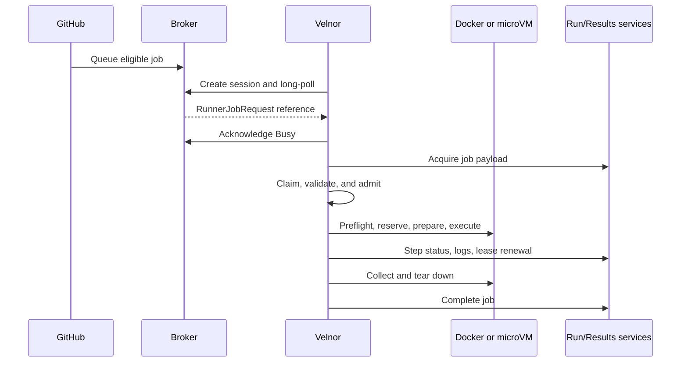

# Job execution

Velnor is a GitHub Actions runner. GitHub remains the scheduler and source of
truth; Velnor admits eligible jobs, executes them, streams progress, and
reports the result.

## Lifecycle



The broker message is a delivery notification, not the full job. Velnor
acquires the payload from the Run Service, then claims the job locally. A host
lock and atomic in-flight marker fence duplicate delivery.

Admission happens before checkout, downloads, container creation, cache or
artifact work, leases, or injection of job execution credentials. It checks
the trust policy, capability manifest, action graph, job shape, and selected
backend. Rejection is fail-closed.

After admission, Velnor reserves capacity, renews the GitHub job lease,
normalizes the workspace and environment, executes ordered steps, publishes
step and timeline updates, drains publishers, reports completion, and cleans
up. Teardown is mandatory; the result records whether cleanup completed.

## Admission and supported work

Velnor does not run arbitrary Actions workflows. It admits a **closed
allowlist** of action identities compiled into the capability manifest, and
rejects everything else at planning, before any side effect.

Supported work is:

- shell and script steps;
- the actions in the allowlist below, at an allowlisted ref;
- `${{ }}` expressions and `if:` conditions — see
  [Expressions and conditions](/reference/expressions);
- checkout, cache, artifacts, summaries, outputs, masks, service containers,
  Buildx, and testcontainers, where the selected backend and trust scope permit.

The allowlist has two kinds of entry. Most identities are handled by a **native
Rust adapter** — Velnor implements the behavior itself and never fetches or
executes the action's JavaScript:

```text
actions/checkout                     actions/cache
actions/upload-artifact              actions/download-artifact
actions/upload-pages-artifact        actions/configure-pages
actions/deploy-pages                 actions/attest-build-provenance
actions/create-github-app-token      actions/github-script
dorny/paths-filter                   jdx/mise-action
mozilla-actions/sccache-action       rui314/setup-mold
extractions/setup-just               Swatinem/rust-cache
crazy-max/ghaction-github-runtime    renovatebot/github-action
docker/setup-buildx-action           docker/login-action
docker/metadata-action               docker/build-push-action
docker/bake-action                   docker/setup-qemu-action
hadolint/hadolint-action             sigstore/cosign-installer
```

A smaller set is fetched and executed generically, at pinned commit SHAs with a
closed input surface: `tailrocks/velnor-actions` (specific subpaths),
`jackin-project/jackin-role-action`, `fsfe/reuse-action` (a Docker action), and
`jdx/mr-boxington-action` (a Node action). Two reusable workflows are admitted
the same way.

Beyond the allowlist, admission also checks: refs must be full 40-character
commit SHAs, except for a named set of legacy tags retained for existing
fixtures; each action's inputs must match its declared input rules, by literal
value where the rule is a literal; subpaths must be declared and must not
escape; and the resolved action closure is bounded in depth, node count, visit
count, response size, and wall time.

## What Velnor does not support

Stated, not implied by omission:

- **Arbitrary JavaScript actions.** A `runs.using: node20`/`node24` action that
  is not in the allowlist is rejected at planning. There is no generic
  JavaScript action runtime open to workflows.
- **Arbitrary Docker actions.** `runs.image` is executed only for allowlisted
  identities; `docker://` references and unlisted Docker actions are rejected.
- **Arbitrary composite actions.** Only allowlisted composites are expanded, and
  they expand into strictly validated native adapters.
- **Unpinned references.** A mutable tag outside the named legacy set fails.
- **Actions that install tooling into an ephemeral Node sidecar.**
  `dtolnay/rust-toolchain`, `baptiste0928/cargo-install`, and
  `EmbarkStudios/cargo-deny-action` are rejected by name with the reason and the
  supported alternative (a pinned `jdx/mise-action` tool), because the sidecar
  they install into is discarded when it exits.
- **`actions/checkout` inputs outside its declared set.** The accepted inputs
  are `repository`, `ref`, `token`, `persist-credentials`, `path`, `clean`,
  `fetch-depth`, `fetch-tags`, and `lfs`. Anything else — `submodules`,
  `sparse-checkout`, `ssh-key`, and the rest — fails admission. Velnor's
  checkout always passes `submodules: false`; there is no submodule support.
- **`actions/cache` subpaths other than `restore` and `save`.**
- **Kache and the former Velnor compiler-cache service.**
- **macOS and Windows.** Execution is Linux-only and macOS labels are rejected.

### MicroVM is narrower than Docker

On the microVM backend, in addition to everything above, a job is rejected when
it:

- uses any step that is not a script step or an allowlisted native adapter —
  the guest implements only checkout, `actions/cache`, `Swatinem/rust-cache`,
  and `mozilla-actions/sccache-action`;
- uses `actions/cache` or `Swatinem/rust-cache` at all, because key-to-blob
  transport is not yet admitted, so those are refused at planning even though
  the guest has an adapter for them;
- sets `lfs: true` on checkout — the guest checkout fetches no LFS objects, and
  approximating that silently is refused;
- names the host Docker socket in any step environment variable or action
  input;
- requests the host Docker socket mount on the job container;
- arrives with an empty guest image, an empty run-service URL, or empty GitHub
  context data.

MicroVM jobs also never receive the Docker Mr Boxington integration or its
mount. Cancellation is not wired end to end on this backend.

## Checkout, cache, and artifacts

Checkout resolves repository, ref, destination, depth, tags, clean behavior,
LFS, and credential persistence. A mirror may be refreshed first; direct
checkout is the fallback. LFS downloads require credentials. Temporary Git
credentials are scoped to the checkout host and removed during cleanup;
cleanup failure is reported in local diagnostics.

`actions/cache` restores from the declared cache root and saves through its
save operation. Unknown or unsafe paths fail closed. Cache keys include the
action reference, operating system, architecture, and declared paths. Some
host-persistent paths use their own persistence rules.

Artifact upload validates and copies declared paths into local artifact
storage, then uploads to GitHub Results Service when runtime credentials and
backend identifiers are present. Downloads use Results Service when available
and otherwise use same-host local artifacts. Paths, archive entries, payloads,
and sizes are bounded.

## Credentials and secrets

The operator PAT is for registration, runner management, and cleanup. It is
not used as a job token. GitHub supplies job credentials in the acquired
payload; Velnor injects the applicable `GITHUB_TOKEN`, Actions runtime token,
OIDC data, cache credentials, and Results Service data only after admission.

Trust scope defaults to `untrusted` and fails closed. A job carrying GitHub
user secrets is refused before execution unless the operator set
`VELNOR_TRUST_SCOPE=trusted`. See [Trust scope](/reference/trust-scope) for the
full capability table and the store partitioning it controls.

Secret variables and mask hints become
runtime masks; masked values are excluded from environment URLs and sanitized
job dumps. Firecracker snapshots must contain no job credentials, and guest
readiness rejects guests that already contain them.

## Backend selection

Select exactly one backend in `/etc/velnor/execution.toml` (or the configured
execution file):

```toml
[execution]
backend = "docker" # or "microvm"
```

There is no automatic fallback. An absent, unreadable, or unknown backend
fails preflight.

### Docker

Docker requires the host Docker socket and a working systemd/cgroup-v2
boundary. The job container owns the job environment; service containers,
Docker actions, Buildx, and testcontainers operate inside the trusted host
boundary. Cancellation signals containers; it does not remove them. Removal is
teardown's job, and teardown also reclaims services, networks, and BuildKit
resources.

#### Docker Rust acceleration

The default job image pins Mr Boxington (`mbx`) 1.7.0 and runs
`mbx setup --yes` while building the image. The generated Cargo launcher is
first on `PATH`, so workflow steps continue to invoke plain `cargo`; those
commands transparently enter Mr Boxington. There is no default
`RUSTC_WRAPPER`. Mr Boxington discovers the container's cgroup constraints and
available resources instead of Velnor hardcoding CPU or memory values for it.

Velnor mounts the job's host-persistent Mr Boxington cache and managed target
directories at `/var/cache/mbx`. The host store is partitioned by the job's
trust class — derived from the operator's pool trust scope, never from the job
payload — and then by numeric GitHub repository ID. A missing or invalid
repository identity fails closed to a job-ephemeral store. See
[Trust scope](/reference/trust-scope) and
[Storage and resource budgets](/operations/storage-and-resources).

Mr Boxington owns garbage collection inside this store. Velnor supplies the
current limits: 20 GiB for its cache, 30 GiB for managed targets, and 50 GiB
combined. These limits operate inside Velnor's host disk accounting; they do
not increase host capacity. Cargo registry and Git source persistence remain
separate stores and are unaffected by Mr Boxington's GC.

#### The per-job resource budget

Velnor derives one budget for the machine and gives each slot its share. The
job container receives `--cpus` and the environment `CARGO_BUILD_JOBS`,
`MAKEFLAGS`, `MBX_SCHEDULER_CPUS`, `MBX_SCHEDULER_MEMORY`, and
`VELNOR_JOB_BUDGET`, appended after the workflow's own environment so a
workflow cannot widen its share. A workflow value that was overridden is named
in `VELNOR_JOB_BUDGET` rather than dropped silently. Full derivation:
[Storage and resource budgets](/operations/storage-and-resources#the-host-budget).

#### Choosing sccache instead

To use the supported alternative, declare
`mozilla-actions/sccache-action` explicitly in the workflow. Velnor then mounts
a trust-partitioned sccache store at `/var/cache/sccache` and sets
`MBX_DISABLE=1`, `RUSTC_WRAPPER=sccache`, `SCCACHE_DIR`,
`SCCACHE_CACHE_SIZE=20G`, and `SCCACHE_GHA_ENABLED=false`. It does not combine
the two accelerators.

These five are applied after the workflow's environment, so on the sccache path
a workflow cannot override `RUSTC_WRAPPER` or re-enable Mr Boxington. On the
default Mr Boxington path nothing sets `MBX_DISABLE` or `RUSTC_WRAPPER`, so
setting `MBX_DISABLE=1` in the workflow does disable Mr Boxington and leaves
plain Cargo.

Kache and the former Velnor compiler-cache service are not available.

### MicroVM

MicroVM uses jailed Firecracker with Docker available inside the guest, never
the host Docker socket. It requires `/dev/kvm`, verified packaged kernel/rootfs
artifacts, a working jailer, isolated namespaces, per-isolation networking,
and the production vsock transport.

The plan is bound to job, isolation, generation, nonce, and plan-hash
identities. Guest handshakes verify those identities and result digests.
Snapshots are reused only when their identity and version match.

The Docker Mr Boxington integration and its mount are not provided to MicroVM
jobs. The guest implements a native `mozilla-actions/sccache-action` adapter
that starts an sccache server inside the guest, but there is no host-persistent
sccache store behind it, so it does not carry compiled state between jobs.
`actions/cache` and `Swatinem/rust-cache` are refused at planning. Cancellation
is not wired end to end: no vsock cancel is sent to the guest.

## Slots and capacity

`VELNOR_SLOTS` sets the number of daemon slots. Each slot registers its own
ephemeral JIT runner and polls GitHub independently. A ready slot waits on the
broker; REST queued-job listings are diagnostic and do not assign work.

Velnor limits both unassigned queue waiting and acquired-job capacity waiting.
The defaults are 300 seconds for queue wait and 120 seconds for disk-capacity
reservation; `VELNOR_QUEUE_WAIT_SECS` and `VELNOR_CAPACITY_WAIT_SECS` tune them
within configured safety floors. A capacity timeout fails the GitHub job
closed rather than oversubscribing the host.

## Cancellation

Active-job cancellation arrives through the busy broker session and is matched
to the job by job ID. A malformed cancellation body is treated conservatively
as a cancellation for this job.

Each job owns exactly one cancellation token. It has two levels:

| Level | Meaning |
| --- | --- |
| `Requested` | GitHub asked for cancellation, or the job timed out |
| `Forced` | the grace period expired; everything still alive must go |

The token is what `success()`, `failure()` and `cancelled()` read, so a
cancelled job's conditions are truthful and `if: cancelled()` post steps run.

Anything that can be terminated registers itself with the token as a
*termination target*, and each target declares the level at which it may die:

| Target | Dies at |
| --- | --- |
| The current step's host process group | `Requested` |
| A Docker action's sidecar container | `Requested` |
| A BuildKit builder container | `Requested` |
| The job container | `Forced` |
| Service containers | `Forced` |

The job and service containers deliberately outlive the request. Upstream stops
them in an `always()` post step, not on the cancellation callback, so
`always()` and `cancelled()` steps must still find a container to run in.
Everything that is the current step's own work dies immediately, which is what
upstream's step cancel token does.

Each target is then walked down one **termination ladder**:

1. `SIGINT`, then wait — 7.5 s by default (`VELNOR_CANCEL_SIGINT_TIMEOUT_MS`);
2. `SIGTERM`, then wait — 2.5 s by default (`VELNOR_CANCEL_SIGTERM_TIMEOUT_MS`);
3. `SIGKILL`, then reap.

Host process groups are signalled with `kill(-pgid, …)`, so a step's whole
process tree goes, not just the process Velnor spawned. Containers are
signalled with `docker kill --signal`; a container that is already gone or not
running counts as terminated. A shared fan-out deadline bounds the whole pass;
past it only `SIGKILL` is sent. Roughly 45 seconds after the request the token
escalates to `Forced` and runs a second pass covering the job and service
containers.

A target that survives `SIGKILL` is recorded as a survivor with its name and
logged; there is no further escalation.

**Cancellation signals; it does not remove.** No ladder level runs `docker rm`.
Container removal, network removal, and BuildKit reclamation belong to
teardown, which runs after collection whether or not the job was cancelled.

Two gaps remain between this model and what a live job drives today, and both
are visible to an operator:

- Only host process groups actually register themselves as termination targets.
  Job, service, Docker-action, and BuildKit containers are terminated on the
  live cancellation path by an older route that issues `docker kill` against
  two container names, so they do not observe the ladder's escalation levels.
- MicroVM cancellation is not wired end to end. The guest agent implements a
  vsock `Cancel` message, but the host never sends one, and the VMM is not a
  registered termination target. Treat a cancelled microVM job as a host-side
  termination event, not as step-level cancellation inside the guest.

## Completion durability

Completion has a stronger durability contract than ordinary progress. In order:

1. The terminal conclusion is recorded before the payload is serialized, so a
   crash mid-serialization still knows what the job decided.
2. The exact payload bytes are written to
   `<state dir>/outbox/<job id>.<generation>` atomically, then the intent and
   its SHA-256 are journalled. Payload first: the reverse order left a
   completing job with no replayable bytes.
3. One durable send claim is taken. There is never a second concurrent send.
4. Only then is `completejob` called.
5. On acknowledgement the journal records it, and only then is the payload file
   removed.

The outbox is bounded, not infinite. A pending entry carries an attempt count,
a permanence flag, and a deadline, and it stops being retried when any of these
is true:

- the run service **permanently refused** it — any 4xx except 408, 409, and
  429. Every other status, and any error carrying no HTTP status at all, is
  transient: not knowing the remote's answer is exactly when retrying is right;
- **8 attempts** have been spent, where an attempt is a full transport retry
  loop rather than one request;
- **6 hours** have passed since the intent was committed.

An entry whose budget is spent becomes *unresolvable*: the payload file is
removed and the slot is freed, and **GitHub is never told the job finished** —
the run service will time the job out. The reason is preserved permanently in
the journal, as one of "the run service permanently refused this completion
payload", "the durable completion send budget is spent", or "the completion
resolution deadline passed". The journal exposes these for inspection; an
abandoned entry no longer counts toward outbox age.

A run-service response saying the job is already terminal remotely is not a
failure. It is recorded as a terminal remote observation and closes the entry
without inventing a second completion.

After a crash, the controller finds jobs whose worker process is gone, matches
them against the durable in-flight marker, verifies the payload checksum, and
replays the *same* payload under the existing claim. It never creates a second
claim, and it abandons rather than replaying when the budget is already spent.

## Communication failures and limits

Empty `204` or empty-success broker responses mean idle. Authentication and
other non-success responses are errors, with credential refresh or backoff as
appropriate. Acquisition retries only classified transient failures.

Complete GitHub Actions parity, arbitrary guest feature parity, crash-resume of
an executing job, and guaranteed cleanup after uncertain isolation teardown are
not established capabilities.

For operator diagnosis, distinguish stages: no broker delivery means scope,
labels, registration, or connectivity; delivery without execution means
acquisition or admission; local execution without GitHub state means lease,
publisher, completion, or outbox recovery.
