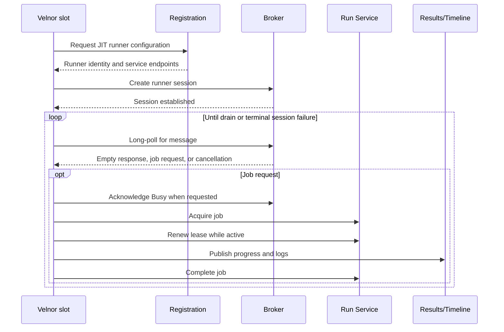
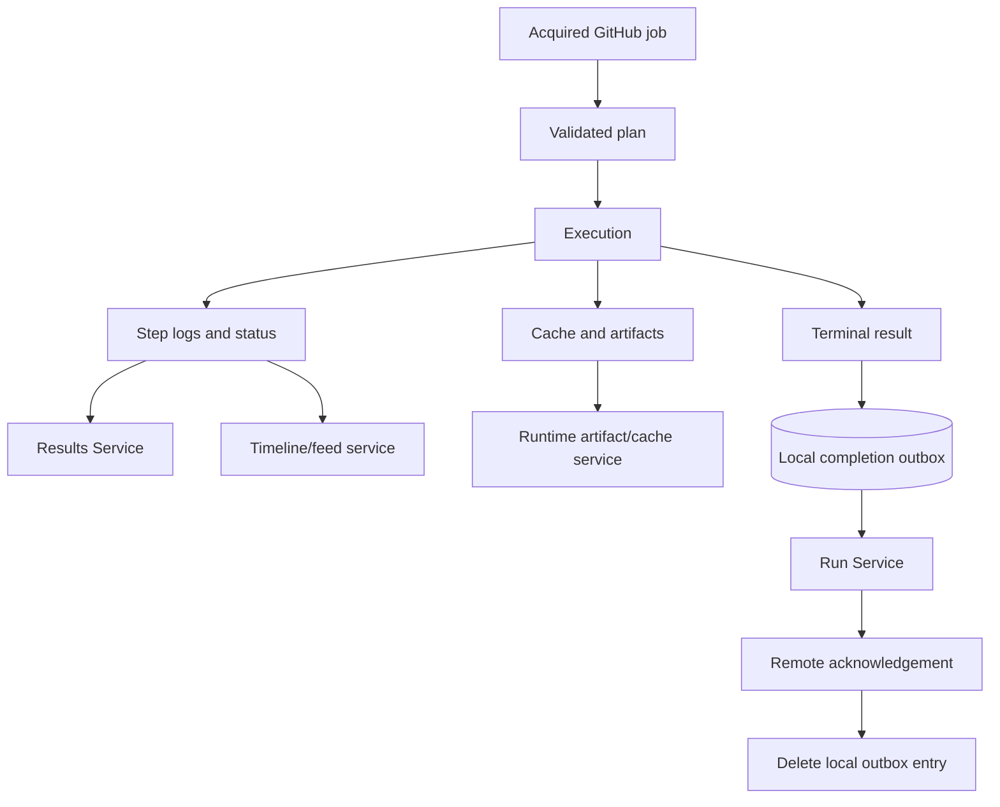

# GitHub Actions Runner V2 protocol

This reference describes the runner protocol Velnor currently implements. It
is for engineers investigating registration, work delivery, job execution,
progress, completion, and interruption behavior.

Velnor follows the protocol shapes and sequencing established by the upstream
[`actions/runner`](https://github.com/actions/runner). That project remains the
protocol authority. This document describes Velnor's adapter behavior and its
intentional limits; it is not a promise of complete upstream equivalence.

## Protocol scope

The active path is one JIT V2 session per ephemeral runner slot. A daemon may
operate several slots, but each slot has its own runner identity, broker
session, lease, and job ownership.

The protocol has four remote service roles:

| Service role | Purpose |
| --- | --- |
| Registration endpoint | Creates a just-in-time runner configuration for a repository, organization, or enterprise scope. |
| Broker | Owns the long-poll session and tells an online runner that work or cancellation is available. |
| Run Service | Supplies the full job, renews ownership, and accepts terminal completion. |
| Results and timeline services | Receive step state, logs, timeline records, feeds, artifacts, and related run data. |

Velnor connects outward to these services over authenticated HTTPS. Normal
operation does not require GitHub to open an inbound connection to the node.

## Session lifecycle

Registration is initiated by Velnor and must return the expected successful
status and a validated identity, runner group, and service endpoints. The
returned credentials are stored locally with restricted permissions. They are
runner-session credentials, not job credentials.

Session creation and polling use retry/backoff for transient failures. Cleanup
is best effort on every loop exit. A broker response indicating no work is an
idle result only when it is an expected successful response. Authentication,
authorization, missing-resource, conflict, rate-limit, and server failures
remain failures and must not be converted into idle polling.

## Message and job acquisition

The broker's job message is a reference, not the complete job definition. It
identifies the run-service location and request identity needed to acquire the
job.

The sequence is:

1. Velnor receives a job request while its session is online.
2. Velnor marks the session busy when the protocol requests an acknowledgement.
3. Velnor requests the full job from the Run Service.
4. Transient transport, timeout, rate-limit, and server failures retry within
   the operation's bounds.
5. A typed permanent response means the request cannot be acquired; Velnor
   closes or recovers the session according to the response class.
6. Velnor claims the local `(plan, job)` identity before execution. Duplicate
   delivery is fenced by the local in-flight claim and host-wide plan/job lock.

The acquired payload supplies the workflow/job identity, steps, actions,
variables, masks, services, outputs, permissions, runtime URLs, and job
credentials needed to build the execution plan.

## Lease and status behavior

After acquisition, Velnor renews the job lease periodically until GitHub accepts
terminal completion. Lease loss, missing registration, or a terminal remote
response stops normal execution and enters cancellation or recovery handling.

The broker session reports the runner as `Online` while idle and `Busy` while
executing. These are remote session statuses, not a complete health model.
Local readiness also requires valid configuration, writable durable state,
backend preflight, routing policy, registration, and fresh slot heartbeats.

An exact typed Run Service `404` during a terminal operation may be recorded as
the remote already observing the job as terminal. This is distinct from treating
an arbitrary failed request as success.

## Admission before side effects

Velnor parses and validates the complete action closure before it performs
checkout, downloads, credential injection, cache mutation, service startup,
or executor work. Admission checks include:

- repository and trust policy;
- action references, metadata, inputs, and supported action forms;
- transitive local, remote, JavaScript, Docker, and composite action needs;
- compiled capabilities and runner labels;
- backend restrictions and resource bounds.

An unsupported or unsafe job fails closed. The result is a backend-neutral
validated plan. Exactly one configured backend consumes it: `docker` or
`microvm`. There is no protocol-level or execution-level fallback.

## Progress and result transport

During execution, Velnor may send:

- step status and log records to the Results Service;
- timeline records and feeds to the Distributed Task service;
- artifact and cache data through the runtime services when the acquired job
  exposes the required credentials and identifiers;
- terminal result, outputs, environment URL, and billing metadata to the Run
  Service.

These are Velnor-initiated authenticated uploads or request/response calls.
They are not inbound callbacks. Progress publication is best effort and
bounded; terminal completion is coordinated separately and has stronger local
durability.

## Durable completion outbox

Before sending a terminal result, Velnor serializes a bounded completion
payload into a job- and generation-specific local outbox entry. The entry is
claimed under a recovery lock. Velnor then:

1. sends the exact payload to the Run Service;
2. records the remote terminal acknowledgement;
3. removes the outbox entry only after acknowledgement;
4. clears the local in-flight marker after completion handling.

If the process or network fails between these steps, recovery can retry the
same payload and preserve ownership evidence. It does not fabricate a new
result from partial memory. Missing, non-regular, symlinked, oversized, or
orphaned entries fail closed and are retained or quarantined for inspection.

This guarantee applies to completion intent. Bounded logs, telemetry, and
normal operational projections have weaker retention and may not be rebuilt
after service recreation.

## Interruption matrix

| Interruption | Velnor behavior | Operator interpretation |
| --- | --- | --- |
| Broker idle response | Continue polling. | Healthy idle only if the response is an expected successful empty response. |
| Broker transport failure | Back off and retry; authentication failures trigger credential/session recovery. | Inspect session health and credentials before assuming GitHub has no work. |
| Job acquisition transient failure | Retry while retaining the session where allowed. | The runner saw work; it may not yet have acquired the payload. |
| Job acquisition permanent failure | Stop that acquisition/session path according to the typed response. | Inspect GitHub job state and the classified response. |
| Lease renewal failure | Retry transient errors; registration loss cancels the job. | A locally running process is not proof GitHub still considers the job owned. |
| Drain or service stop | Idle slots exit at a poll boundary; active jobs drain, then escalation may terminate them. | GitHub may see cancellation or infrastructure failure if the deadline expires. |
| Job cancellation | Active broker cancellation is matched to the job; Velnor cancels execution and reports terminal state. | Cancellation is not equivalent to a normal successful completion. |
| Progress upload failure | Continue execution when safe; retain bounded local evidence. | GitHub's live log/timeline can lag or be incomplete even while local execution continues. |
| Completion request failure | Retry transient failures; preserve the outbox until acknowledgement or terminal remote observation. | Inspect outbox age and remote job state before retrying manually. |
| Process crash after completion staging | Replay the exact outbox payload during recovery. | A staged completion is stronger evidence than an in-memory success message. |

## Cancellation semantics: Velnor versus upstream

The upstream runner's usual model sends a cancellation request to the worker,
allows the worker to handle it, and escalates to process termination after a
timeout.

Velnor's active V2 path differs. Its Docker cancellation path directly
terminates the relevant host-side job/action containers. The Firecracker path
does not provide full end-to-end equivalence to upstream worker cancellation.
Velnor still drains publishers, collects available state, and attempts terminal
completion, but operators must not assume identical graceful step cancellation
or cleanup timing.

This is the principal intentional adapter difference. Broker session creation,
long polling, job acquisition, lease renewal, completion, status mapping, and
retry classification otherwise follow the upstream V2 model where implemented.

## Protocol troubleshooting

Use the stage that first diverges from the expected sequence:

- No registration: verify scope, runner group, credentials, and registration
  response validation.
- No broker delivery: verify the slot is registered and `Online`; distinguish
  expected empty polls from authentication or transport errors.
- Reference received, no execution: inspect acquisition response, local claim,
  admission decision, capabilities, routing, and backend preflight.
- Execution without GitHub progress: inspect Results/Timeline upload errors,
  bounded local logs, and the job's lease state.
- Local completion without GitHub completion: inspect the completion outbox,
  remote terminal state, acknowledgement evidence, and retry classification.

The [architecture overview](/concepts/architecture) explains ownership and
data flow. The [interface reference](/reference/interface) lists the currently exposed
operator surfaces and their visibility limits.
