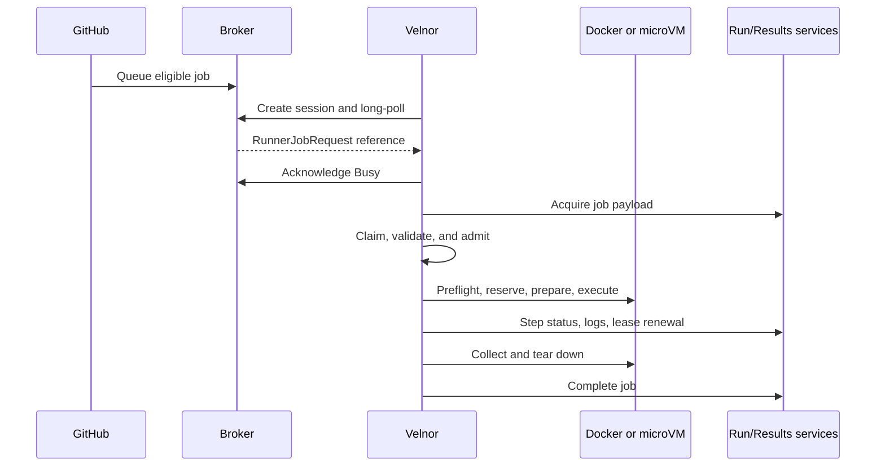

# Job execution

Velnor is a GitHub Actions runner. GitHub remains the scheduler and source of
truth; Velnor admits eligible jobs, executes them, streams progress, and
reports the result.

## Lifecycle



The broker message is a delivery notification, not the full job. Velnor
acquires the payload from the Run Service, then claims the job locally. A host
lock and atomic in-flight marker fence duplicate delivery.

Admission happens before checkout, downloads, container creation, cache or
artifact work, leases, or injection of job execution credentials. It checks
the trust policy, capability manifest, action graph, job shape, and selected
backend. Rejection is fail-closed.

After admission, Velnor reserves capacity, renews the GitHub job lease,
normalizes the workspace and environment, executes ordered steps, publishes
step and timeline updates, drains publishers, reports completion, and cleans
up. Teardown is mandatory; the result records whether cleanup completed.

## Admission and supported work

Action references are resolved before side effects. Native adapters are
explicitly allowlisted, and action references must satisfy the configured
capability manifest and pinning rules.

Supported forms include:

- shell/script steps;
- JavaScript actions with supported `runs.using` metadata and `runs.main`;
- Docker actions with `runs.image`;
- composite actions supported by the planner;
- checkout, cache, artifact, summaries, outputs, masks, services, Buildx, and
  testcontainer features where the selected backend and trust policy permit.

Unsupported or restricted work fails admission. This includes unknown action
forms, unsupported JavaScript runtimes, missing Docker action images, unsafe
paths or archive entries, unpinned or unavailable action references, nested
local composite actions, nested Docker composites, and tool-install actions
that require a persistent Node sidecar. MicroVM execution has a narrower
subset: it rejects unsupported action forms, cache actions, empty execution
context, and host-socket mounts.

## Checkout, cache, and artifacts

Checkout resolves repository, ref, destination, depth, tags, clean behavior,
LFS, and credential persistence. A mirror may be refreshed first; direct
checkout is the fallback. LFS downloads require credentials. Temporary Git
credentials are scoped to the checkout host and removed during cleanup;
cleanup failure is reported in local diagnostics.

`actions/cache` restores from the declared cache root and saves through its
save operation. Unknown or unsafe paths fail closed. Cache keys include the
action reference, operating system, architecture, and declared paths. Some
host-persistent paths use their own persistence rules.

Artifact upload validates and copies declared paths into local artifact
storage, then uploads to GitHub Results Service when runtime credentials and
backend identifiers are present. Downloads use Results Service when available
and otherwise use same-host local artifacts. Paths, archive entries, payloads,
and sizes are bounded.

## Credentials and secrets

The operator PAT is for registration, runner management, and cleanup. It is
not used as a job token. GitHub supplies job credentials in the acquired
payload; Velnor injects the applicable `GITHUB_TOKEN`, Actions runtime token,
OIDC data, cache credentials, and Results Service data only after admission.

Non-trusted scopes reject user secrets. Secret variables and mask hints become
runtime masks; masked values are excluded from environment URLs and sanitized
job dumps. Firecracker snapshots must contain no job credentials, and guest
readiness rejects guests that already contain them.

## Backend selection

Select exactly one backend in `/etc/velnor/execution.toml` (or the configured
execution file):

```toml
[execution]
backend = "docker" # or "microvm"
```

There is no automatic fallback. An absent, unreadable, or unknown backend
fails preflight.

### Docker

Docker requires the host Docker socket and a working systemd/cgroup-v2
boundary. The job container owns the job environment; service containers,
Docker actions, Buildx, and testcontainers operate inside the trusted host
boundary. Cancellation removes owned job containers and cleanup reclaims
services, networks, and BuildKit resources.

### MicroVM

MicroVM uses jailed Firecracker with Docker available inside the guest, never
the host Docker socket. It requires `/dev/kvm`, verified packaged kernel/rootfs
artifacts, a working jailer, isolated namespaces, per-isolation networking,
and the production vsock transport.

The plan is bound to job, isolation, generation, nonce, and plan-hash
identities. Guest handshakes verify those identities and result digests.
Snapshots are reused only when their identity and version match. Compiler
cache is disabled for MicroVM. End-to-end cancellation is not currently wired
for MicroVM.

## Slots and capacity

`VELNOR_SLOTS` sets the number of daemon slots. Each slot registers its own
ephemeral JIT runner and polls GitHub independently. A ready slot waits on the
broker; REST queued-job listings are diagnostic and do not assign work.

Velnor limits both unassigned queue waiting and acquired-job capacity waiting.
The defaults are 300 seconds for queue wait and 120 seconds for disk-capacity
reservation; `VELNOR_QUEUE_WAIT_SECS` and `VELNOR_CAPACITY_WAIT_SECS` tune them
within configured safety floors. A capacity timeout fails the GitHub job
closed rather than oversubscribing the host.

## Communication failures and limits

Empty `204` or empty-success broker responses mean idle. Authentication and
other non-success responses are errors, with credential refresh or backoff as
appropriate. Acquisition and completion retry only classified transient
failures. Completion stores the exact payload in a durable outbox before
sending it; acknowledgement precedes outbox deletion, so a restart can replay
the same completion.

Active-job cancellation arrives through the busy broker session. Docker
cancellation is implemented; MicroVM cancellation is not end to end. Complete
GitHub Actions parity, arbitrary guest feature parity, crash-resume of an
executing job, and guaranteed cleanup after uncertain isolation teardown are
not established capabilities.

For operator diagnosis, distinguish stages: no broker delivery means scope,
labels, registration, or connectivity; delivery without execution means
acquisition or admission; local execution without GitHub state means lease,
publisher, completion, or outbox recovery.
